### Temporal

[Temporal](https://temporal.io) is a distributed workflow orchestration platform that enables developers to build, run, and scale reliable, long-running workflows with fault tolerance, retries, and state management. It ensures workflows persist through failures and provides tools for monitoring, debugging, and replaying executions.

### Ansible

Ansible is an open-source automation tool used for configuring systems, deploying software, and orchestrating IT tasks. It uses YAML-based playbooks to define tasks and operates over SSH, requiring no agents on target systems. Ansible simplifies infrastructure management by automating repetitive tasks like server provisioning, application deployment, and configuration updates.


### Ansible without/without Temporal

Temporal addresses challenges in automating workflows by providing a robust framework for managing complex, long-running processes that require reliability, scalability, and fault tolerance. Without Temporal, running Ansible playbooks or similar automation tasks can face issues like failed executions due to transient errors, lack of visibility into ongoing processes, inability to resume workflows after system crashes, and difficulty in coordinating multiple dependent tasks. Temporal ensures that workflows can recover gracefully from failures, maintain state across retries, and allow dynamic adjustments based on runtime conditions. It also enables seamless integration of different tools and systems within a single workflow, making it easier to orchestrate multi-step operations that involve not just Ansible but potentially other infrastructure or application management tools. By handling the complexities of task coordination, retries, and state management, Temporal allows developers to focus on defining the logic of their workflows rather than worrying about the underlying execution mechanics.

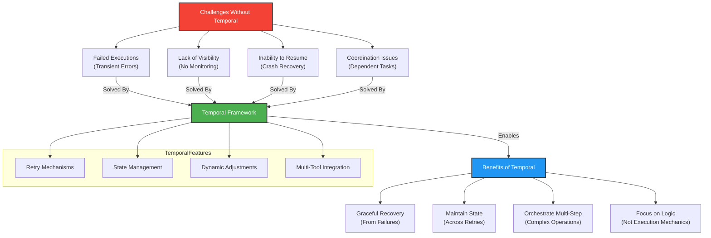

### Simple workflow

[](https://radikal.host/i/IGWUQg)

[](https://radikal.host/i/Ir0Q5K)

```yaml
ansible_workflows:
  stage: deploy
  tags:
    - shell
  script:
    - python3 ansible.py --playbook apt_update.yml
```

#### Long-Running Workflows with Checkpointing

Problem: Ansible playbooks fail on long-running tasks (e.g., cloud provisioning, multi-hour deployments).
Solution:
Use Temporal workflows to automatically resume from failures.
Checkpoint progress (e.g., "50% of VMs deployed") even if the process crashes.
```python
@workflow.defn
class AnsibleWorkflow:
    async def run(self, playbook: str):
        while not workflow.is_replaying():
            result = await workflow.execute_activity(
                run_ansible_playbook,
                args=[playbook],
                start_to_close_timeout=timedelta(hours=6),
                heartbeat_timeout=timedelta(minutes=5),
            )
            if result.failed:
                await asyncio.sleep(300)  # Retry after 5 minutes
```

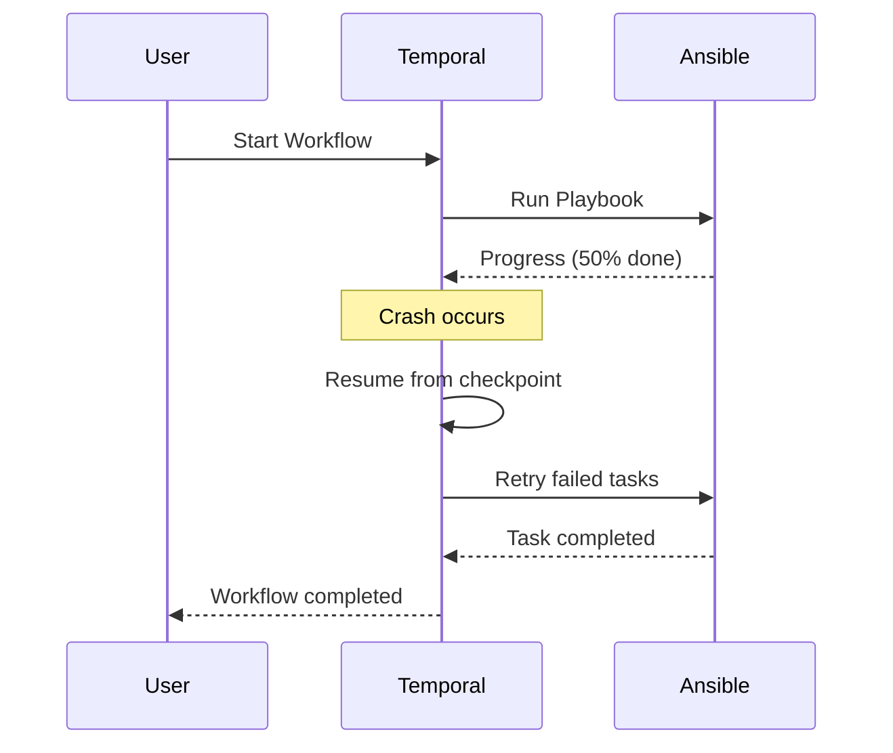


#### Dynamic Parallel Execution

Problem: Ansible’s async is limited—hard to manage 1000s of nodes dynamically.
Solution:
Fan-out/fan-in workflows (e.g., deploy 500 VMs in parallel, then aggregate results).
```python
async def deploy_vms():
    vm_list = await get_vm_list_from_api()
    results = await asyncio.gather(
        *[run_ansible_playbook(f"deploy_vm.yml --extra-vars 'vm_id={vm.id}'") for vm in vm_list]
    )
    return sum(results)
```

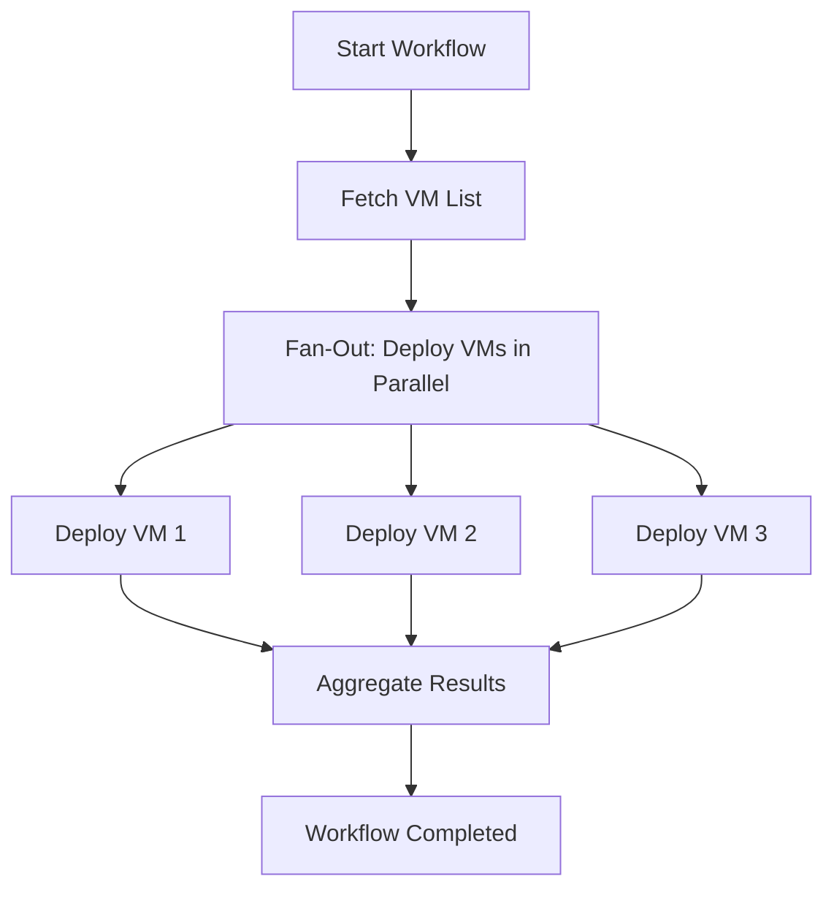

#### Human-in-the-Loop Approvals

Problem: Ansible Tower requires manual static approvals.
Solution:
Dynamic pauses (e.g., "Wait for Slack approval before deleting prod DB").
```python
@workflow.defn
class ProdDeploymentWorkflow:
    async def run(self):
        await run_ansible_playbook("deploy_staging.yml")
        if workflow.is_replaying():
            await workflow.wait_for_signal("prod_approval")
        else:
            await send_slack_approval_request()
            await workflow.wait_for_signal("prod_approval")  # Blocks until approved
        await run_ansible_playbook("deploy_prod.yml")
```

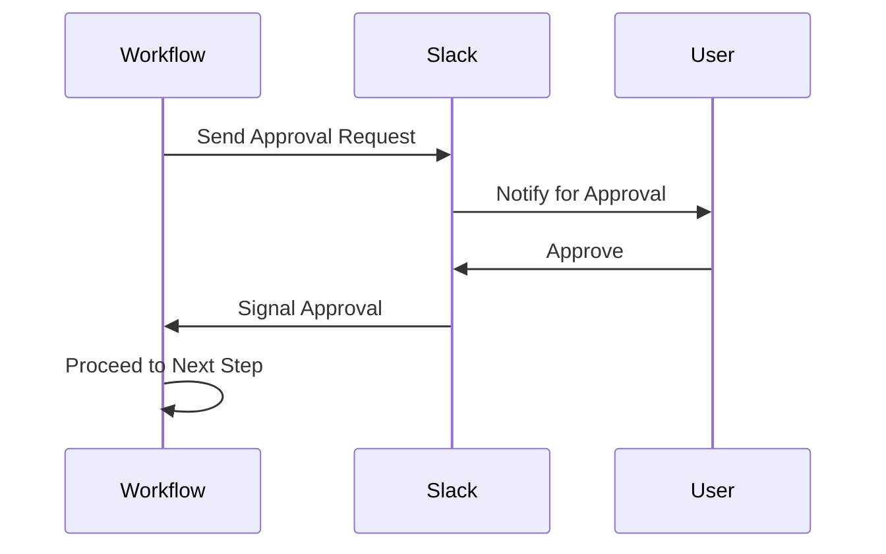

#### Cross-Cloud Orchestration

Problem: Ansible alone can’t coordinate AWS + Azure + GCP workflows.
Solution:
Temporal workflows orchestrate multi-cloud playbooks:
```python
async def migrate_to_aws():
    await run_ansible_playbook("azure_shutdown.yml")
    await run_ansible_playbook("aws_provision.yml")
    if await check_aws_health():
        await run_ansible_playbook("cutover_dns.yml")
```

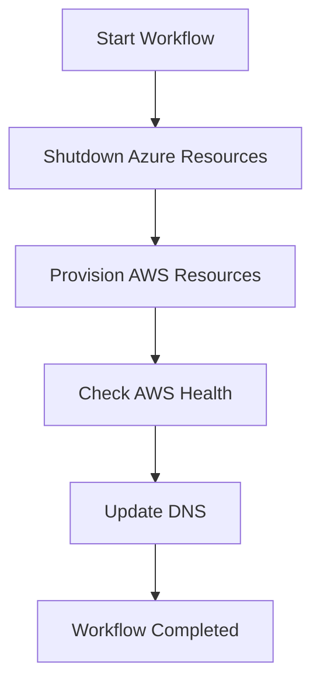

#### Event-Driven Ansible (EDA) on Steroids

Problem: Ansible EDA reacts to simple events (e.g., webhooks).
Solution:
Complex event chains (e.g., "If CPU > 90% for 5min, scale + notify PagerDuty + ticket").
```python
async def auto_scale_workflow():
    while True:
        metrics = await fetch_cloud_metrics()
        if metrics.cpu > 90:
            await run_ansible_playbook("scale_out.yml")
            await page_team()
            await workflow.sleep(timedelta(minutes=5))  # Cooldown
```

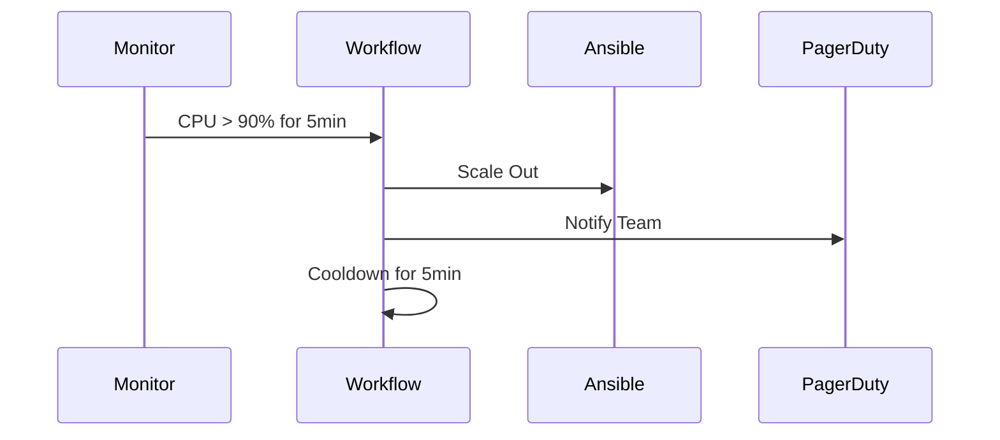

#### Stateful Workflows with Recovery

Problem: Ansible has no memory of past runs.
Solution:
Temporal remembers state (e.g., "Retry only failed nodes after outage").
```python
async def patch_workflow():
    hosts = await get_hosts()
    for host in hosts:
        try:
            await run_ansible_playbook(f"patch.yml -l {host}")
        except ActivityError:
            await log_failed_host(host)
    if workflow.is_replaying():
        await retry_failed_hosts()  # Only retries what crashed
```

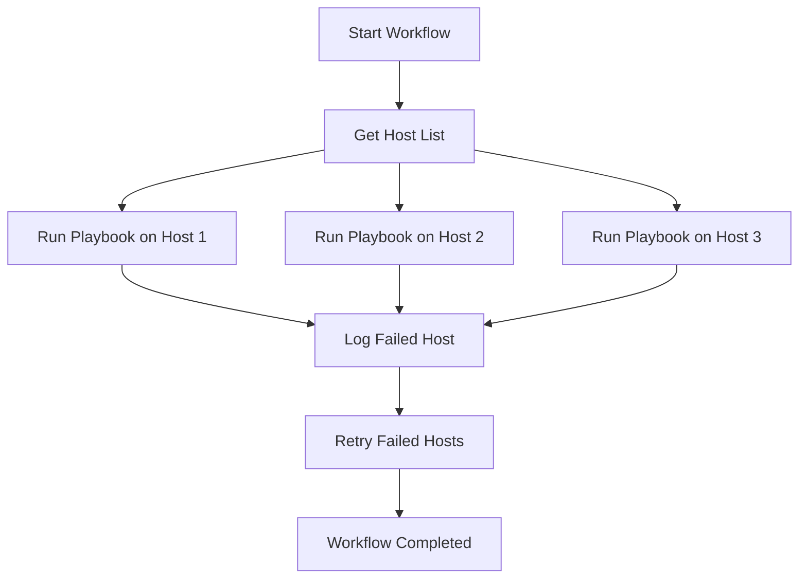

#### Time Travel Debugging

Problem: Debugging Ansible failures is painful.
Solution:
Replay workflows exactly (e.g., "See why playbook failed 3 days ago").
```python
# Temporal UI shows full history + inputs/outputs for every step.
```

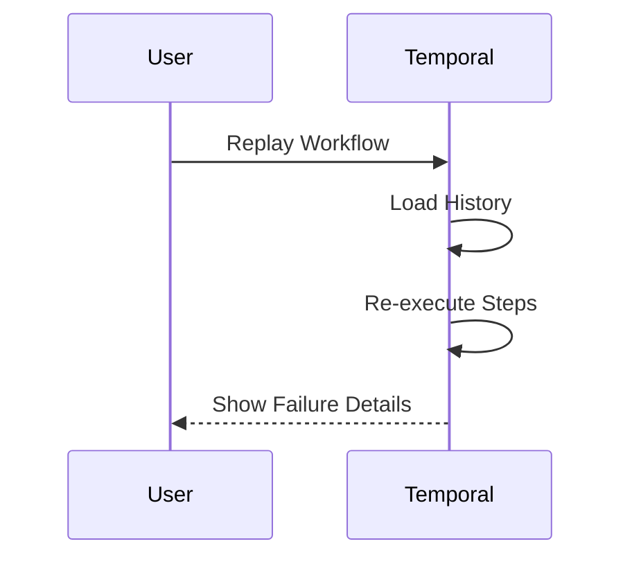

#### Cross-Tool Chaining

Problem: Ansible can’t seamlessly call Terraform + Kubernetes.
Solution:
Mix tools in one workflow:

```python
async def deploy_full_stack():
    await run_terraform("apply")
    await run_kubectl("apply -f k8s/")
    await run_ansible_playbook("configure_ingress.yml")
```

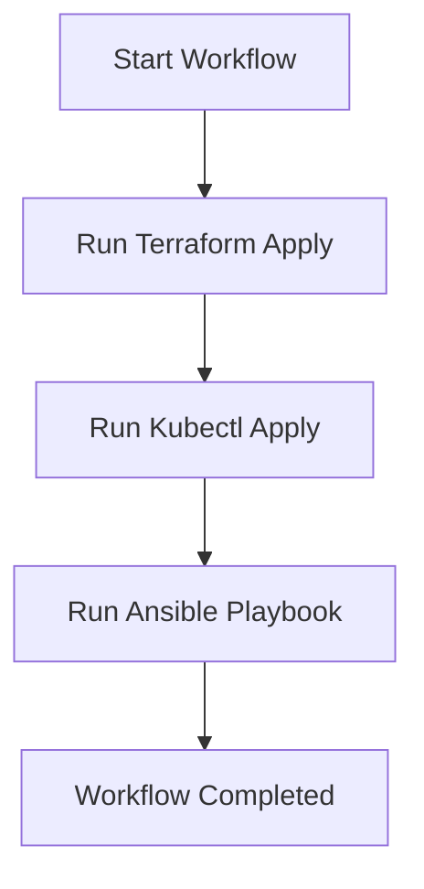
### Dynamic Ansible inventory

Here’s how to create a dynamic Ansible inventory using a Temporal workflow that fetches host data from a CMDB via REST API, ensuring real-time, fault-tolerant infrastructure management:
```
Temporal Workflow → Fetches CMDB Data (REST API) → Generates Dynamic Inventory → Runs Ansible
```

```python
#!/usr/bin/env python3
import requests
import json
import argparse

def fetch_cmdb_hosts(cmdb_api_url: str, token: str) -> dict:
    headers = {"Authorization": f"Bearer {token}"}
    response = requests.get(f"{cmdb_api_url}/hosts", headers=headers)
    response.raise_for_status()
    return response.json()

def generate_inventory(cmdb_data: dict) -> dict:
    inventory = {
        "_meta": {"hostvars": {}},
        "all": {"hosts": []},
        "web": {"hosts": []},
        "db": {"hosts": []}
    }
    
    for host in cmdb_data["hosts"]:
        inventory["all"]["hosts"].append(host["name"])
        inventory["_meta"]["hostvars"][host["name"]] = {
            "ansible_host": host["ip"],
            "ansible_user": host["user"],
            "ansible_become": True
        }
        if host["role"] == "web":
            inventory["web"]["hosts"].append(host["name"])
        elif host["role"] == "db":
            inventory["db"]["hosts"].append(host["name"])
    
    return inventory

if __name__ == "__main__":
    parser = argparse.ArgumentParser()
    parser.add_argument("--list", action="store_true", help="List all hosts")
    args = parser.parse_args()
    
    if args.list:
        cmdb_data = fetch_cmdb_hosts(
            cmdb_api_url="https://cmdb.example.com/api",
            token="your-api-token"
        )
        print(json.dumps(generate_inventory(cmdb_data)))
```

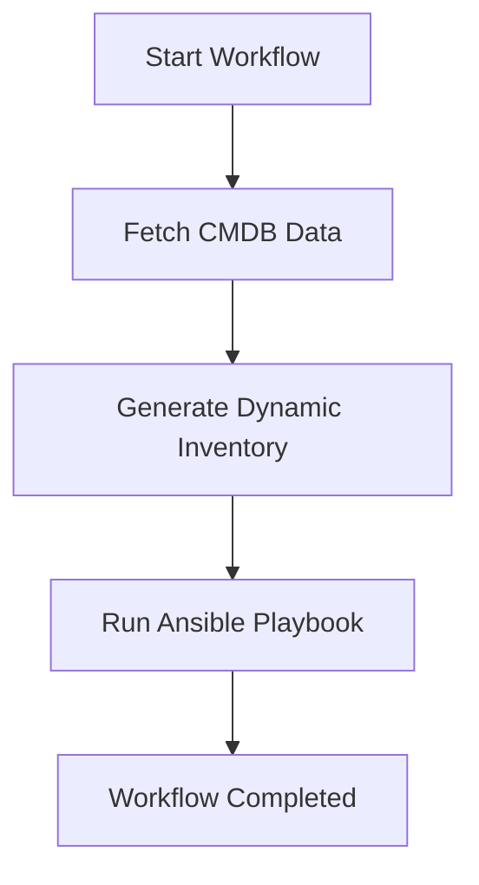


#### GitLab

To integrate the Temporal-based Ansible workflow with a **GitLab webhook** , you can configure GitLab to trigger the workflow whenever specific events occur (e.g., a push to a branch, a merge request, or a tag creation).

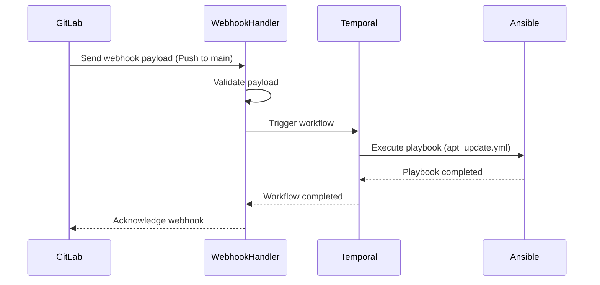

#### Main use cases

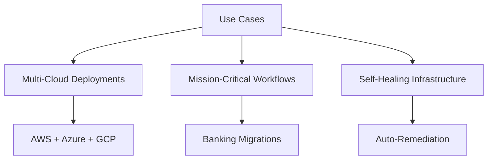


---

- Complex multi-cloud deployments
- Mission-critical workflows (e.g., banking migrations)
- Self-healing infra (e.g., auto-remediation)

---
### Terraform

Using Terraform and Temporal together offers a powerful combination for infrastructure automation, addressing gaps that arise when using either tool in isolation. Terraform excels at declarative infrastructure provisioning but requires custom providers for new or niche services, which can be time-consuming to develop and maintain. On the other hand, Temporal provides a robust orchestration layer for automating workflows, including those involving APIs, without the need for custom providers. For example, you can use Temporal to seamlessly automate interactions with services like Equinix Metal, GoDaddy, or VMware via their REST APIs, orchestrating complex, stateful workflows that Terraform alone cannot handle. While Terraform focuses on defining and managing infrastructure as code, Temporal complements it by enabling dynamic, fault-tolerant, and long-running operations, such as retries, approvals, and cross-service coordination. Together, they allow teams to leverage Terraform's strength in infrastructure provisioning while relying on Temporal for workflow automation, creating a more flexible and scalable solution than using either tool alone.

```mermaid
[](https://radikal.host/i/IGzdeE)
```
