# Tabel of contents

[Preface](#preface)
[Ansible without/with Temporal](#Ansible-without/without-Temporal)
[Simple Workflow]()
[Long-Running Workflows with Checkpointing]()
[Dynamic Parallel Execution]()
[Human-in-the-Loop Approvals]()
[Cross-Cloud Orchestration]()
[Event-Driven Ansible (EDA) on Steroids]()
[Stateful Workflows with Recovery]()
[Time Travel Debugging]()
[Cross-Tool Chaining]()
[Dynamic Ansible Inventory]()
[GitLab Integration]()
[Main Use Cases]()
[Terraform]()
[Database Migrations]()


## Preface

When it comes to orchestrating complex workflows in hybrid cloud environments, Temporal stands out as one of the best open-source tools available. It doesn’t try to replace tools like Terraform or Ansible but instead complements them by adding a layer of reliability, scalability, and flexibility.

For example, while Terraform excels at provisioning infrastructure and Ansible handles configuration management, Temporal ties everything together. It ensures that workflows can recover from failures, adapt to runtime conditions, and integrate seamlessly with external systems like monitoring tools, CMDBs, or approval processes. And because it’s open source, it avoids vendor lock-in while supporting virtually any technology stack.

The real value of workflow orchestrator lies in its ability to handle long-running, dynamic workflows without skipping a beat. Whether it’s waiting for a VM to pass health checks, triggering a Kubernetes deployment, or updating a CMDB after provisioning, Temporal keeps things running smoothly. It’s not about reinventing the wheel—it’s about making the tools you already use work better, together.

Another advantage is how Temporal handles long-running processes common in Day 2 operations. For instance, if you’re migrating workloads between clouds or performing a rolling update across a Kubernetes cluster, Temporal keeps track of progress and ensures the workflow resumes from where it left off—even if there’s a failure or interruption. This makes it ideal for tasks like database upgrades, application rollbacks, or compliance audits, where consistency and reliability are critical.

In short, Temporal helps IT teams move faster and more efficiently without sacrificing control or governance, which is exactly what modern enterprises need in today’s fast-changing hybrid cloud world.


### Ansible without/without Temporal

Temporal addresses challenges in automating workflows by providing a robust framework for managing complex, long-running processes that require reliability, scalability, and fault tolerance. Without Temporal, running Ansible playbooks or similar automation tasks can face issues like failed executions due to transient errors, lack of visibility into ongoing processes, inability to resume workflows after system crashes, and difficulty in coordinating multiple dependent tasks. Temporal ensures that workflows can recover gracefully from failures, maintain state across retries, and allow dynamic adjustments based on runtime conditions. It also enables seamless integration of different tools and systems within a single workflow, making it easier to orchestrate multi-step operations that involve not just Ansible but potentially other infrastructure or application management tools. By handling the complexities of task coordination, retries, and state management, Temporal allows developers to focus on defining the logic of their workflows rather than worrying about the underlying execution mechanics.

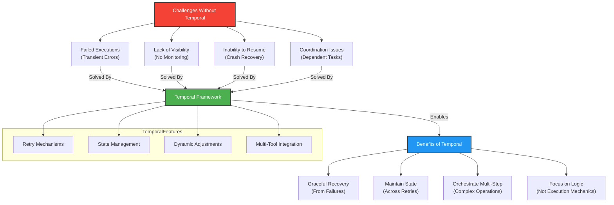

### Simple workflow

This Python script shows how to use Temporal to run an Ansible playbook, like one that updates system packages on a server. It sets up a workflow and activity to execute the playbook in a reliable way, with features like retries, live output streaming, and clean shutdowns.

The execute_ansible_playbook activity runs the ansible-playbook command using asyncio to capture and display the output as it happens. You can pass the playbook file and, optionally, an inventory file. If something goes wrong and the playbook fails, the script raises an error, and Temporal automatically retries the operation up to three times before stopping.

The AnsibleWorkflow defines the workflow logic, which basically calls the activity to run the playbook. It’s set up with timeouts and retry policies to handle cases where the playbook takes a long time or runs into temporary issues.

When you run the script, it connects to a Temporal server, starts a worker to listen for tasks, and immediately kicks off the workflow to run the playbook you specify. For example, you could point it to a playbook like update_packages.yml, which might use Ansible modules like apt or yum to update packages on your servers. The script ensures the playbook runs smoothly, streams its output in real-time, and handles interruptions or errors without losing track of what’s happening.

This approach is great for automating tasks like updating packages across servers, where reliability and visibility are key. By using Temporal, you get built-in retries, fault tolerance, and the ability to monitor and debug the process easily if something doesn’t go as planned.

```python
import asyncio
import uuid
import sys
import os
import signal
import argparse
from datetime import timedelta
from temporalio import workflow, activity
from temporalio.client import Client
from temporalio.worker import Worker
from temporalio.common import RetryPolicy

# --- Activity Definition ---
@activity.defn
async def execute_ansible_playbook(playbook_path: str, inventory_path: str = None) -> str:
    """Execute ansible-playbook with live output."""
    cmd = ["ansible-playbook", playbook_path]
    if inventory_path:
        cmd.extend(["-i", inventory_path])

    proc = await asyncio.create_subprocess_exec(
        *cmd,
        stdout=asyncio.subprocess.PIPE,
        stderr=asyncio.subprocess.PIPE
    )

    output = []
    while True:
        stdout_chunk = await proc.stdout.read(1024)
        stderr_chunk = await proc.stderr.read(1024)

        if not stdout_chunk and not stderr_chunk:
            break

        if stdout_chunk:
            sys.stdout.write(stdout_chunk.decode())
            sys.stdout.flush()
            output.append(stdout_chunk.decode())

        if stderr_chunk:
            sys.stderr.write(stderr_chunk.decode())
            sys.stderr.flush()
            output.append(f"ERROR: {stderr_chunk.decode()}")

    exit_code = await proc.wait()
    if exit_code != 0:
        raise RuntimeError(f"Playbook failed with exit code {exit_code}")

    return "".join(output)

# --- Workflow Definition ---
@workflow.defn
class AnsibleWorkflow:
    @workflow.run
    async def run(self, params: dict) -> str:
        return await workflow.execute_activity(
            execute_ansible_playbook,
            args=[params["playbook_path"], params.get("inventory_path")],
            start_to_close_timeout=timedelta(minutes=15),
            retry_policy=RetryPolicy(
                initial_interval=timedelta(seconds=30),
                maximum_interval=timedelta(minutes=2),
                maximum_attempts=3
            )
        )

async def run_workflow_and_worker(playbook_path: str, inventory_path: str = None):
    """Start worker and execute workflow automatically"""
    shutdown_event = asyncio.Event()
    client = None
    worker = None

    def signal_handler():
        shutdown_event.set()

    loop = asyncio.get_running_loop()
    loop.add_signal_handler(signal.SIGINT, signal_handler)
    loop.add_signal_handler(signal.SIGTERM, signal_handler)

    try:
        # Connect to Temporal
        client = await Client.connect("localhost:7233")

        # Start worker
        worker = Worker(
            client,
            task_queue="ansible-queue",
            workflows=[AnsibleWorkflow],
            activities=[execute_ansible_playbook],
            graceful_shutdown_timeout=timedelta(seconds=5)
        )

        # Run worker in background
        worker_task = asyncio.create_task(worker.run())

        # Execute workflow
        print(f"Executing playbook: {playbook_path}")
        result = await client.execute_workflow(
            AnsibleWorkflow.run,
            args=[{"playbook_path": playbook_path, "inventory_path": inventory_path}],
            id=f"ansible-{uuid.uuid4()}",
            task_queue="ansible-queue",
            execution_timeout=timedelta(minutes=20)
        )

        print("\nPlaybook execution result:")
        print(result)

    except Exception as e:
        print(f"Error: {str(e)}")
        raise
    finally:
        # Clean shutdown
        shutdown_event.set()
        if worker:
            await worker.shutdown()

if __name__ == "__main__":
    parser = argparse.ArgumentParser()
    parser.add_argument("--playbook", required=True, help="Path to playbook file")
    parser.add_argument("--inventory", help="Path to inventory file")
    args = parser.parse_args()

    # Validate paths
    if not os.path.exists(args.playbook):
        print(f"Error: Playbook not found at {args.playbook}")
        sys.exit(1)
    if args.inventory and not os.path.exists(args.inventory):
        print(f"Error: Inventory file not found at {args.inventory}")
        sys.exit(1)

    try:
        asyncio.run(run_workflow_and_worker(args.playbook, args.inventory))
    except KeyboardInterrupt:
        print("\nProcess stopped by user")
        sys.exit(0)
    except Exception as e:
        print(f"\nError: {str(e)}")
        sys.exit(1)
```

This command lists all workflows of type AnsibleWorkflow that are currently tracked by Temporal:
```
tctl workflow list --query "WorkflowType='AnsibleWorkflow'"
```

This command starts a new instance of the AnsibleWorkflow to execute the apt_update.yml playbook:
```
tctl workflow run \
    --taskqueue ansible-queue \
    --workflow_type AnsibleWorkflow \
    --input '"apt_update.yml"'
```

`--inventory` is optional in this case.

This command retrieves detailed information about a specific workflow instance identified by its workflow:
```
tctl workflow show -w ansible-1dcbe2e1-8b10-4616-8e11-948cb81d83b1
```
Temporal UI simplifies workflow management by providing an intuitive interface to check statuses, inspect details, and take actions like canceling workflows when necessary.
[](https://radikal.host/i/Ir0Q5K)

This GitLab pipeline job, ansible_workflows, automates the execution of an Ansible playbook like apt_update.yml to update system packages. It runs in the deploy stage using a shell executor and triggers a Python script (ansible.py) that orchestrates the playbook via Temporal.

The script uses Temporal to run the playbook reliably, with features like retries and live output streaming. If the playbook fails, the pipeline reflects the error for easy debugging. This setup integrates infrastructure updates into your CI/CD process, ensuring reliable and automated deployments.

```yaml
ansible_workflows:
  stage: deploy
  tags:
    - shell
  script:
    - python3 ansible.py --playbook apt_update.yml
```

[](https://radikal.host/i/IGWUQg)


#### Long-Running Workflows with Checkpointing

Problem: Ansible playbooks fail on long-running tasks (e.g., cloud provisioning, multi-hour deployments).
Solution:
Use Temporal workflows to automatically resume from failures.
Checkpoint progress (e.g., "50% of VMs deployed") even if the process crashes.
```python
@workflow.defn
class AnsibleWorkflow:
    async def run(self, playbook: str):
        while not workflow.is_replaying():
            result = await workflow.execute_activity(
                run_ansible_playbook,
                args=[playbook],
                start_to_close_timeout=timedelta(hours=6),
                heartbeat_timeout=timedelta(minutes=5),
            )
            if result.failed:
                await asyncio.sleep(300)  # Retry after 5 minutes
```

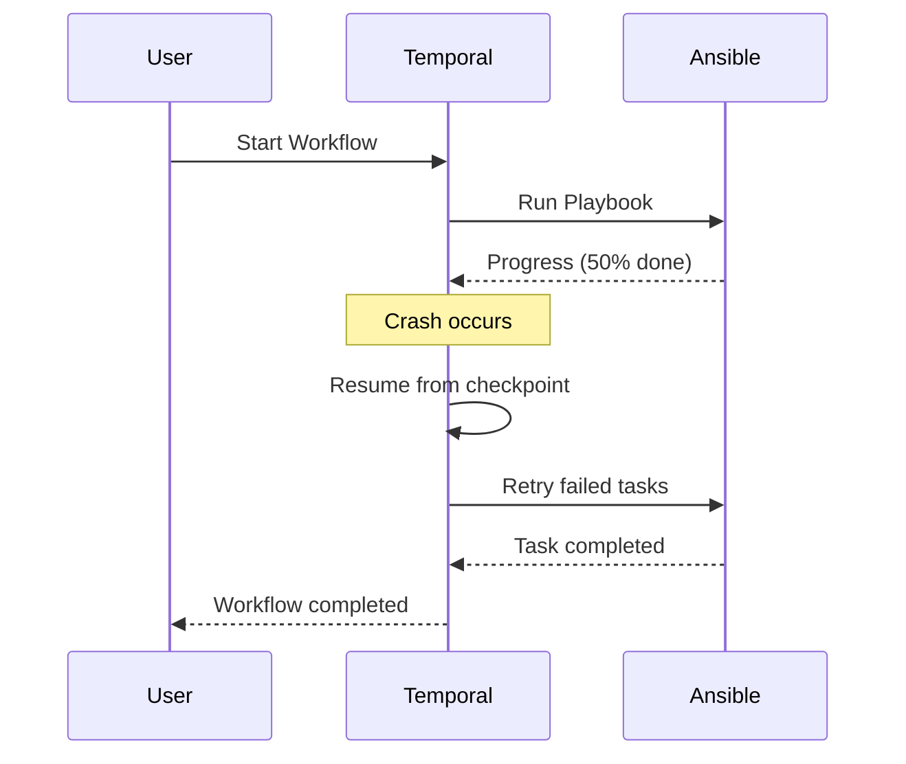


#### Dynamic Parallel Execution

Problem: Ansible’s async is limited—hard to manage 1000s of nodes dynamically.
Solution:
Fan-out/fan-in workflows (e.g., deploy 500 VMs in parallel, then aggregate results).
```python
async def deploy_vms():
    vm_list = await get_vm_list_from_api()
    results = await asyncio.gather(
        *[run_ansible_playbook(f"deploy_vm.yml --extra-vars 'vm_id={vm.id}'") for vm in vm_list]
    )
    return sum(results)
```

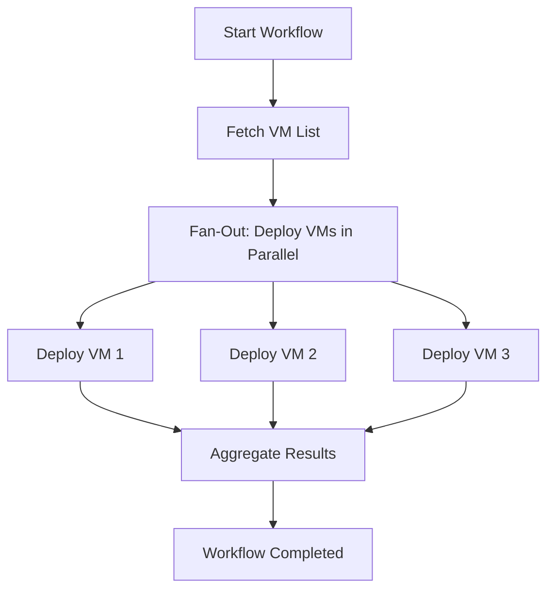

#### Human-in-the-Loop Approvals

Problem: Ansible Tower requires manual static approvals.
Solution:
Dynamic pauses (e.g., "Wait for Slack approval before deleting prod DB").
```python
@workflow.defn
class ProdDeploymentWorkflow:
    async def run(self):
        await run_ansible_playbook("deploy_staging.yml")
        if workflow.is_replaying():
            await workflow.wait_for_signal("prod_approval")
        else:
            await send_slack_approval_request()
            await workflow.wait_for_signal("prod_approval")  # Blocks until approved
        await run_ansible_playbook("deploy_prod.yml")
```

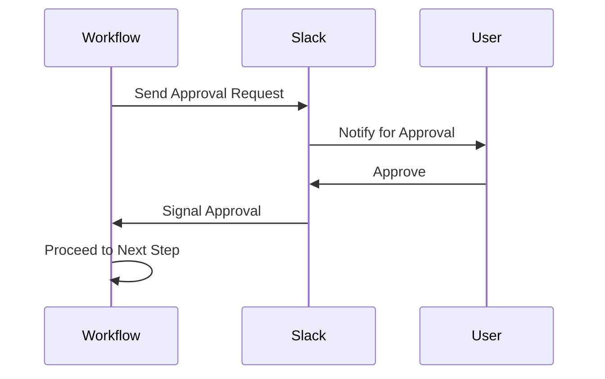

#### Cross-Cloud Orchestration

Problem: Ansible alone can’t coordinate AWS + Azure + GCP workflows.
Solution:
Temporal workflows orchestrate multi-cloud playbooks:
```python
async def migrate_to_aws():
    await run_ansible_playbook("azure_shutdown.yml")
    await run_ansible_playbook("aws_provision.yml")
    if await check_aws_health():
        await run_ansible_playbook("cutover_dns.yml")
```

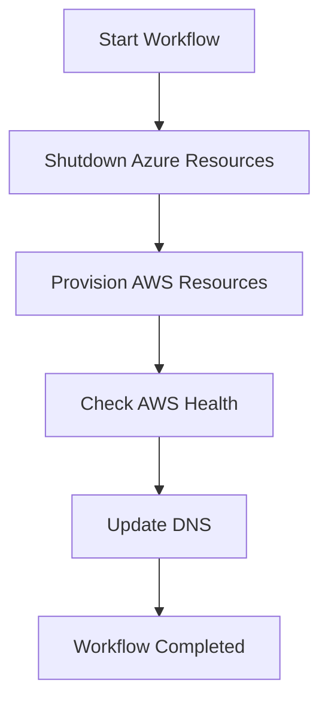

#### Event-Driven Ansible (EDA) on Steroids

Problem: Ansible EDA reacts to simple events (e.g., webhooks).
Solution:
Complex event chains (e.g., "If CPU > 90% for 5min, scale + notify PagerDuty + ticket").
```python
async def auto_scale_workflow():
    while True:
        metrics = await fetch_cloud_metrics()
        if metrics.cpu > 90:
            await run_ansible_playbook("scale_out.yml")
            await page_team()
            await workflow.sleep(timedelta(minutes=5))  # Cooldown
```

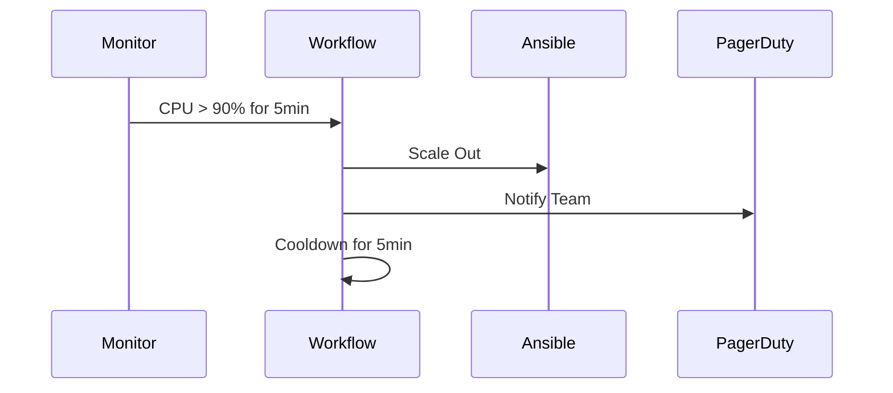

#### Stateful Workflows with Recovery

Problem: Ansible has no memory of past runs.
Solution:
Temporal remembers state (e.g., "Retry only failed nodes after outage").
```python
async def patch_workflow():
    hosts = await get_hosts()
    for host in hosts:
        try:
            await run_ansible_playbook(f"patch.yml -l {host}")
        except ActivityError:
            await log_failed_host(host)
    if workflow.is_replaying():
        await retry_failed_hosts()  # Only retries what crashed
```

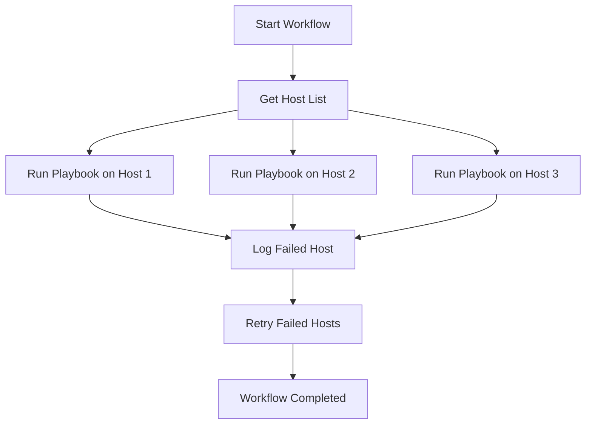

#### Time Travel Debugging

Problem: Debugging Ansible failures is painful.
Solution:
Replay workflows exactly (e.g., "See why playbook failed 3 days ago").
```python
# Temporal UI shows full history + inputs/outputs for every step.
```

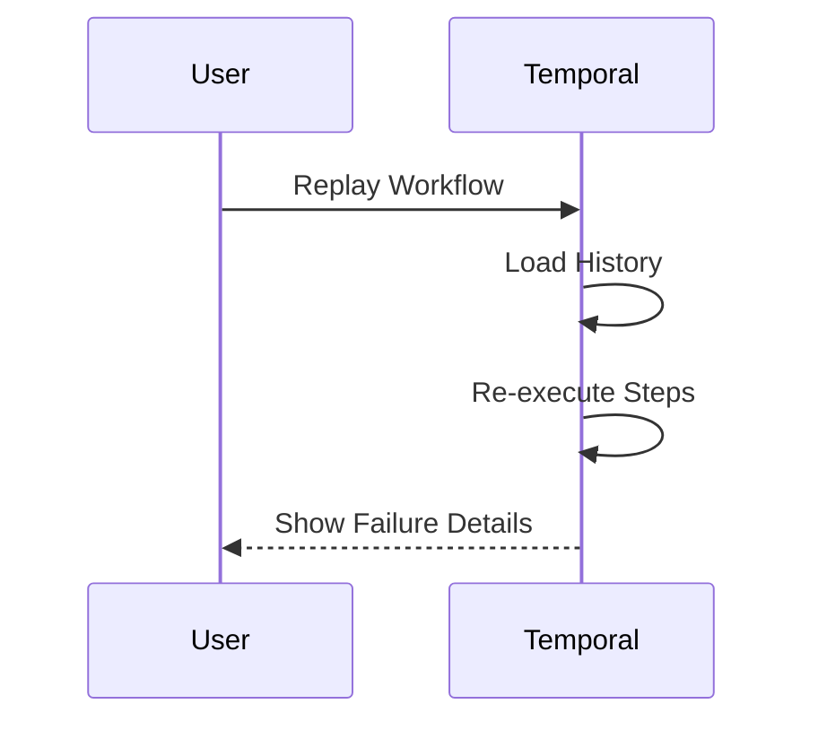

#### Cross-Tool Chaining

Problem: Ansible can’t seamlessly call Terraform + Kubernetes.
Solution:
Mix tools in one workflow:

```python
async def deploy_full_stack():
    await run_terraform("apply")
    await run_kubectl("apply -f k8s/")
    await run_ansible_playbook("configure_ingress.yml")
```

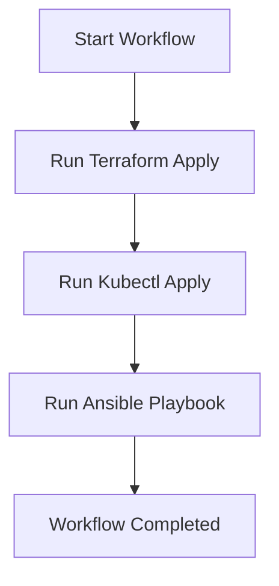
### Dynamic Ansible inventory

Here’s how to create a dynamic Ansible inventory using a Temporal workflow that fetches host data from a CMDB via REST API, ensuring real-time, fault-tolerant infrastructure management:
```
Temporal Workflow → Fetches CMDB Data (REST API) → Generates Dynamic Inventory → Runs Ansible
```

```python
def fetch_cmdb_hosts(cmdb_api_url: str, token: str) -> dict:
    headers = {"Authorization": f"Bearer {token}"}
    response = requests.get(f"{cmdb_api_url}/hosts", headers=headers)
    response.raise_for_status()
    return response.json()

def generate_inventory(cmdb_data: dict) -> dict:
    inventory = {
        "_meta": {"hostvars": {}},
        "all": {"hosts": []},
        "web": {"hosts": []},
        "db": {"hosts": []}
    }
    
    for host in cmdb_data["hosts"]:
        inventory["all"]["hosts"].append(host["name"])
        inventory["_meta"]["hostvars"][host["name"]] = {
            "ansible_host": host["ip"],
            "ansible_user": host["user"],
            "ansible_become": True
        }
        if host["role"] == "web":
            inventory["web"]["hosts"].append(host["name"])
        elif host["role"] == "db":
            inventory["db"]["hosts"].append(host["name"])
    
    return inventory
```

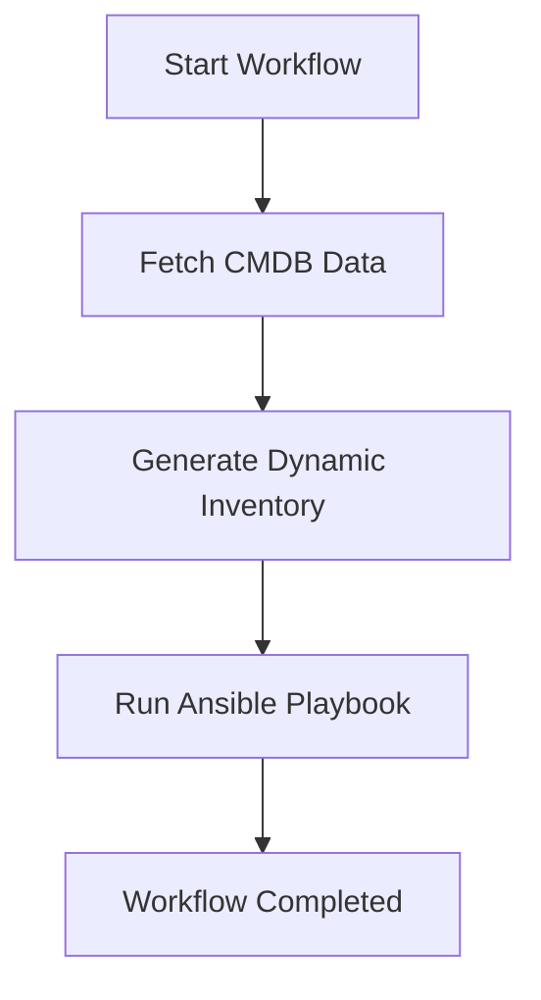


#### GitLab

To integrate the Temporal-based Ansible workflow with a **GitLab webhook** , you can configure GitLab to trigger the workflow whenever specific events occur (e.g., a push to a branch, a merge request, or a tag creation).

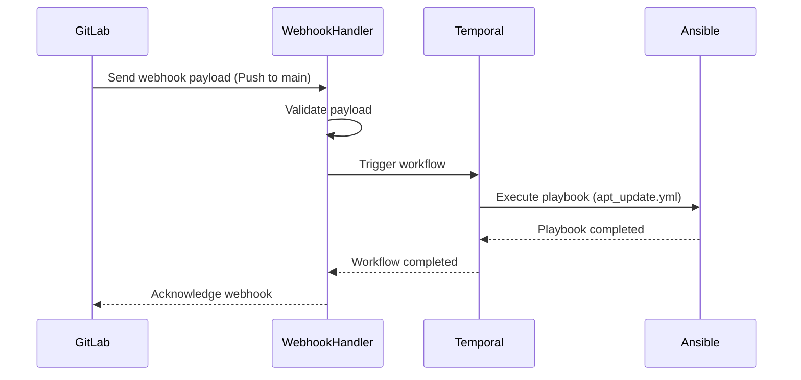

#### Main use cases

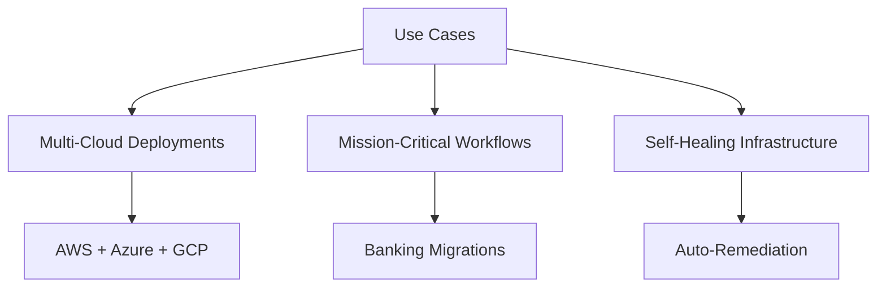

---
### Terraform

Using Terraform and Temporal together offers a powerful combination for infrastructure automation, addressing gaps that arise when using either tool in isolation. Terraform excels at declarative infrastructure provisioning but requires custom providers for new or niche services, which can be time-consuming to develop and maintain. On the other hand, Temporal provides a robust orchestration layer for automating workflows, including those involving APIs, without the need for custom providers. For example, you can use Temporal to seamlessly automate interactions with services like Equinix Metal, GoDaddy, or VMware via their REST APIs, orchestrating complex, stateful workflows that Terraform alone cannot handle. While Terraform focuses on defining and managing infrastructure as code, Temporal complements it by enabling dynamic, fault-tolerant, and long-running operations, such as retries, approvals, and cross-service coordination. Together, they allow teams to leverage Terraform's strength in infrastructure provisioning while relying on Temporal for workflow automation, creating a more flexible and scalable solution than using either tool alone.

An example of a GitLab pipeline (.gitlab-ci.yml) that integrates with the Temporal workflow to deploy a VMware virtual machine using Terraform. This pipeline assumes you have already set up the Temporal server and worker, and it uses the Python-based Temporal workflow provided earlier.


```yaml
stages:
  - setup
  - terraform-init
  - terraform-plan
  - terraform-apply
  - temporal-workflow

variables:
  TERRAFORM_DIR: "terraform"
  TEMPORAL_TASK_QUEUE: "vmware-task-queue"

setup-dependencies:
  stage: setup
  image: python:3.9
  script:
    - apt-get update && apt-get install -y terraform
    - pip install temporalio requests
  artifacts:
    paths:
      - $TERRAFORM_DIR

terraform-init:
  stage: terraform-init
  image: hashicorp/terraform:latest
  script:
    - cd $TERRAFORM_DIR
    - terraform init
  artifacts:
    paths:
      - $TERRAFORM_DIR/.terraform

terraform-plan:
  stage: terraform-plan
  image: hashicorp/terraform:latest
  script:
    - cd $TERRAFORM_DIR
    - terraform plan -out=tfplan
  dependencies:
    - terraform-init
  artifacts:
    paths:
      - $TERRAFORM_DIR/tfplan

terraform-apply:
  stage: terraform-apply
  image: hashicorp/terraform:latest
  script:
    - cd $TERRAFORM_DIR
    - terraform apply -auto-approve tfplan
  dependencies:
    - terraform-plan

temporal-workflow:
  stage: temporal-workflow
  image: python:3.9
  script:
    - apt-get update && apt-get install -y git
    - pip install temporalio requests
    - git clone https://github.com/your-repo/temporal-vmware-workflow.git 
    - cd temporal-vmware-workflow
    - python run_workflow.py --task-queue $TEMPORAL_TASK_QUEUE --terraform-dir $TERRAFORM_DIR
  dependencies:
    - terraform-apply
```

The Temporal-based workflow for deploying VMware VMs with Terraform is far more flexible than traditional Terraform setups. Unlike plain Terraform, which is limited to provisioning resources, Temporal acts as an orchestration layer that can easily integrate external systems like monitoring tools, CMDBs, and other services. For example, after Terraform provisions a VM, the workflow can automatically update a CMDB, trigger health checks in a monitoring system, or send notifications to stakeholders.

Temporal also handles retries and failures gracefully, ensuring the workflow continues even if a step like a CMDB update fails. It supports dynamic decision-making, such as querying a monitoring system to decide whether to proceed, and can pause for human approval when needed. This makes it ideal for complex, real-world scenarios where infrastructure deployment doesn’t stop at provisioning—it involves integrating with multiple tools and processes seamlessly.

```python
@activity.defn
async def run_terraform_init(working_dir: str) -> str:
    result = subprocess.run(["terraform", "init"], cwd=working_dir, capture_output=True, text=True)
    if result.returncode != 0:
        raise Exception(f"Terraform init failed: {result.stderr}")
    return result.stdout
...
@activity.defn
async def run_terraform_apply(working_dir: str) -> str:
    result = subprocess.run(["terraform", "apply", "-auto-approve", "tfplan"], cwd=working_dir, capture_output=True, text=True)
    if result.returncode != 0:
        raise Exception(f"Terraform apply failed: {result.stderr}")
    return result.stdout
...
```
### Database migrations

Large database migrations, especially for production systems with 500GB or more of data, can be incredibly complex and risky. Tools like Liquibase are great for managing schema changes and versioning, but when it comes to executing these migrations reliably—particularly in distributed or hybrid environments—they often fall short on their own. This is where Temporal shines.

Temporal adds a layer of orchestration that ensures migrations run smoothly, even for massive databases. For example, migrating a 500GB+ production database might involve steps like backing up data, applying schema changes, validating the migration, and rolling back if something goes wrong. Temporal coordinates these steps, retries failed tasks automatically, and keeps track of progress to avoid starting over if the process is interrupted.

It’s also perfect for handling long-running operations that can take hours or even days. If a migration hits an issue—a network outage or a spike in database load—Temporal can pause the workflow and resume once conditions improve. And because real-world migrations often require human oversight, Temporal can pause for approvals before making critical changes, like altering a schema in production, and then proceed once the green light is given.

By integrating with monitoring tools, backup systems, and other external services, Temporal ensures everything stays in sync throughout the migration. Whether you’re moving terabytes of data across regions or applying delicate schema updates to a live system, Temporal bridges the gap between Liquibase’s capabilities and the operational complexity of modern database management.

Below is a single Go file that implements the Temporal workflow for orchestrating a database schema migration using Liquibase.
```go
package main

import (
    "context"
    "fmt"
    "log"
    "os/exec"

    "go.temporal.io/sdk/activity"
    "go.temporal.io/sdk/client"
    "go.temporal.io/sdk/worker"
    "go.temporal.io/sdk/workflow"
)

// Workflow Input Struct
type MigrationInputs struct {
    DatabaseURL     string // Connection URL for the database
    ChangelogFile   string // Path to the Liquibase changelog file
    BackupRequired  bool   // Whether a backup is needed before migration
}

// Workflow Definition
func DatabaseMigrationWorkflow(ctx workflow.Context, inputs MigrationInputs) error {
    logger := workflow.GetLogger(ctx)

    if inputs.BackupRequired {
        logger.Info("Starting database backup...")
        backupActivity := workflow.ExecuteActivity(ctx, BackupDatabase, inputs.DatabaseURL)
        if err := backupActivity.Get(ctx, nil); err != nil {
            return fmt.Errorf("database backup failed: %w", err)
        }
        logger.Info("Database backup completed successfully.")
    }

    logger.Info("Starting Liquibase schema migration...")
    updateActivity := workflow.ExecuteActivity(ctx, RunLiquibaseUpdate, LiquibaseInput{
        DatabaseURL:   inputs.DatabaseURL,
        ChangelogFile: inputs.ChangelogFile,
    })
    if err := updateActivity.Get(ctx, nil); err != nil {
        return fmt.Errorf("liquibase update failed: %w", err)
    }
    logger.Info("Liquibase schema migration completed successfully.")

    logger.Info("Validating the migration...")
    validateActivity := workflow.ExecuteActivity(ctx, ValidateMigration, inputs.DatabaseURL)
    if err := validateActivity.Get(ctx, nil); err != nil {
        return fmt.Errorf("migration validation failed: %w", err)
    }
    logger.Info("Migration validation completed successfully.")

    logger.Info("Notifying the team...")
    notifyActivity := workflow.ExecuteActivity(ctx, NotifyTeam, "Database migration completed successfully.")
    if err := notifyActivity.Get(ctx, nil); err != nil {
        logger.Warn("Failed to send notification, but migration was successful.", "Error", err)
    }

    return nil
}

// Activity: Backup the database
func BackupDatabase(ctx context.Context, databaseURL string) error {
    cmd := exec.CommandContext(ctx, "pg_dump", "-Fc", "-f", "/backups/db_backup.dump", databaseURL)
    if err := cmd.Run(); err != nil {
        return fmt.Errorf("failed to execute backup command: %w", err)
    }
    return nil
}

// Activity: Run Liquibase update
type LiquibaseInput struct {
    DatabaseURL   string
    ChangelogFile string
}

func RunLiquibaseUpdate(ctx context.Context, input LiquibaseInput) error {
    cmd := exec.CommandContext(ctx, "liquibase", "--url", input.DatabaseURL, "--changeLogFile", input.ChangelogFile, "update")
    if err := cmd.Run(); err != nil {
        return fmt.Errorf("liquibase update failed: %w", err)
    }
    return nil
}

// Activity: Validate the migration
func ValidateMigration(ctx context.Context, databaseURL string) error {
    // Example: Run a query to check if the schema is applied correctly
    cmd := exec.CommandContext(ctx, "psql", "-c", "SELECT * FROM information_schema.tables WHERE table_schema = 'public';", databaseURL)
    if err := cmd.Run(); err != nil {
        return fmt.Errorf("validation query failed: %w", err)
    }
    return nil
}

// Activity: Notify the team
func NotifyTeam(ctx context.Context, message string) error {
    // Example: Send a notification via Slack or email
    fmt.Println("Notification:", message)
    return nil
}

// Worker Setup
func main() {
    // Create Temporal client
    temporalClient, err := client.Dial(client.Options{})
    if err != nil {
        log.Fatalf("Unable to create Temporal client: %v", err)
    }
    defer temporalClient.Close()

    // Create a worker
    taskQueue := "database-migration-task-queue"
    w := worker.New(temporalClient, taskQueue, worker.Options{})

    // Register the workflow and activities
    w.RegisterWorkflow(DatabaseMigrationWorkflow)
    w.RegisterActivity(BackupDatabase)
    w.RegisterActivity(RunLiquibaseUpdate)
    w.RegisterActivity(ValidateMigration)
    w.RegisterActivity(NotifyTeam)

    // Start the worker
    log.Println("Starting worker...")
    err = w.Run(worker.InterruptCh())
    if err != nil {
        log.Fatalf("Worker failed: %v", err)
    }
}
```
